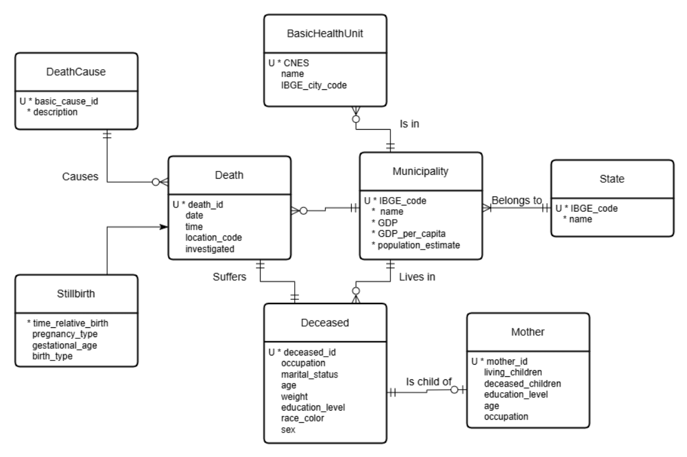
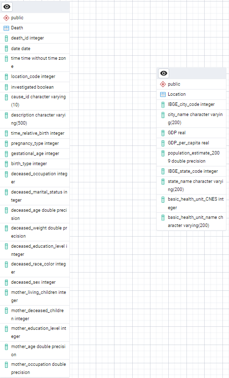

# DuckDB Database Project: Brazilian Mortality  

**Course**: MC536 Databases  
**Repository**: DuckDB-Database-Project-BrazilianMortality  

---

## Overview  
This repository contains the implementation of a DuckDB database for analyzing Brazilian mortality, health, and economic indicators at the municipal and state levels, which are directly related to the "Good Health and Well-Being" Sustainable Development Goal. Data is loaded via Python, with a denormalized schema and scripts for preprocessing, loading, and querying.

---

## Table of Contents  

- [Overview](#overview)  
- [Team Members](#team-members)  
- [Database Schemas](#database-schemas)  
- [Project Goals](#project-goals)  
- [Datasets](#datasets)  
  - [Raw Data](#raw-data)  
  - [Preprocessed Data](#preprocessed-data)  
- [Technology Stack](#technology-stack)  
- [Project Structure](#project-structure)  
- [Setup and Usage](#setup-and-usage)  
  - [Prerequisites](#prerequisites)  
- [Analysis and Queries](#analysis-and-queries)  
- [Results](#results)

---

## Team Members  
- [**Giovani Mambrim Leme (215041)**](https://github.com/Giovanipt2)  
- [**Pietro Fernandes Magaldi (236842)**](https://github.com/pietromagaldi)  
- [**Adriano Ribeiro F. Campos (173253)**](https://github.com/AdrianoCampos05)  

---

## Database Schemas  
The core of this project is the non-relational database designed to integrate the different datasets. Below are visualizations of the conceptual and relational models:

### Conceptual Model  
<div align="center">

</div>


### Logical (Relational) Model  
<div align="center">

</div>

---

## Project Goals  
This project aims to implement a DuckDB database populated via Python with Brazilian data on mortality, health, and GDP of cities and states. The main objectives are:

- Design a denormalized database schema that captures deaths, causes, basic health units, municipalities, states, and demographic details.  
- Populate the database with preprocessed datasets using automated loading scripts (Jupyter Notebooks).  
- Perform data validation to ensure referential integrity and consistency.  
- Formulate and execute five non-trivial queries to extract insights.

**Non-trivial queries:**  
1. _Estimate population, total deaths, and mortality rate (per 1000) by state_  
2. _Find the most common cause of death (modal cause) for each age_  
3. _Analyze death statistics by GDP per capita decile_  
4. _Get the top 3 causes of death (under age 5) by mother's education level_  
5. _Analyze non-external mortality rates grouped by population per health unit_

---

## Datasets  
### Sources
The data used in was obtained from the following sources:

- [Sistema de Informação sobre Mortalidade – SIM](https://dados.gov.br/dados/conjuntos-dados/sim-1979-2019)
- [Produto Interno Bruto per capita](https://dados.gov.br/dados/conjuntos-dados/cgeo_vw_pib_percapita)
- [Códigos dos municípios IBGE](https://www.ibge.gov.br/explica/codigos-dos-municipios.php)
- [Unidades Básicas de Saúde - UBS](https://dados.gov.br/dados/conjuntos-dados/unidades-basicas-de-saude-ubs2)
- [CID-10](http://www2.datasus.gov.br/cid10/V2008/descrcsv.htm#:~:text=CID%2D10%2DSUBCATEGORIAS.,CID%2DO%2DGRUPOS)
### Raw Data  
The following raw datasets were used and are available in the `datasets/` folder:

- `Mortalidade_Geral_2010.csv`: General mortality records for Brazil in 2010.  
- `vw_pib_percapita.csv`: GDP per capita for Brazilian municipalities (view).  
- `IBGE_cidades_2010.csv`: Municipality names and IBGE city codes.  
- `Unidades_Basicas_Saude-UBS.csv`: Basic Health Unit registry.  
- `CID-10-CATEGORIAS.csv`: ICD-10 categories descriptions.

### Preprocessed Data  
After cleaning and transforming raw inputs, the following files in `preprocessed_datasets_NoSQL/` were loaded into the database (each corresponds to one table in the logical model):

- `Death.csv`: Stores date, time, location, death cause, deceased's personal data and other informations about the death.
- `Location.csv`: Stores information about Brazilian states, cities, their GDP, their GDP per capita and their basic health units

---

## Technology Stack  
- **Database**: DuckDB
- **Language**: Python 3.x  
- **Libraries**:  
  - duckdb: DuckDB adapter for Python  
  - pandas: Data manipulation and analysis (used in preprocessing and query result display)  
  - jupyterlab/notebook: For running the `.ipynb` files  
- **Tools**: pgAdmin 4 (for database management and ERD generation)

---

## Project Structure  
```bash
Postgres-Database-Project-BrazilianMortality/
│
├── datasets/  # Original raw datasets
│   ├── Mortalidade_Geral_2010.csv
│   ├── vw_pib_percapita.csv
│   ├── IBGE_cidades_2010.csv
│   ├── Unidades_Basicas_Saude-UBS.csv
│   └── CID-10-CATEGORIAS.csv
│
├── preprocessed_datasets_NoSQL/  # Cleaned CSV files ready for DB import
│   ├── Death.csv
│   └── Municipality.csv
│
├── models/  # Database model files
│   ├── Conceptual_Model.png
│   ├── Logical_Model.pgerd
│   ├── Logical_Model.png
│   └── Physical.sql
│
├── queries/  # Individual queries 
│   ├── cause_by_mothers_education.sql
│   ├── death_cause_by_age.sql
│   ├── life_expectancy_by_gdp.sql
│   ├── mortality_by_health_unit_density.sql
│   └── mortality_by_state.sql
│
├── results/  # Output CSV files from analytical queries
│   ├── cause_by_mothers_education.csv
│   ├── death_cause_by_age.csv
│   ├── life_expectancy_by_gdp.csv
│   ├── mortality_by_health_unit_density.csv
│   └── mortality_by_state.csv
│
├── database_creation_and_queries.ipynb  # Jupyter notebook for DB creation, data loading, and querying
├── preprocessing.ipynb  # Jupyter notebook for preprocessing raw data
├── python/  # Python notebooks for workflows
│   ├── preprocessing.ipynb  # Data cleaning and preprocessing
│   ├── tables.ipynb  # Creates DB connection, tables, and loads data
│   └── queries.ipynb  # Contains the five project queries
└── README.md  # This file
```
## Setup and Usage

### Prerequisites
1. Python 3.x
2. DuckDB  
3. pip (Python package installer)
4. Required Python libraries:  
```bash
pip install psycopg2-binary pandas jupyterlab ipykernel>=6
```
    *(Note: `ipykernel` needed for Jupyter)*
5.  **Clone Repository:** Clone this repository to your local machine.
    ```bash
    git clone <repository-url>
    cd DuckDB-Database-Project-BrazilianMortality
    ```
6.  **CSV Files:** Ensure the CSV files are present in the `/preprocessed_datasets_NoSQL` directory.

### Database Setup

1. Establish Connection:
Open the [`python/tables.ipynb`](./python/tables.ipynb). Locate the database connection parameters near the beginning of the script.

    ```python
    # --- Database Connection Parameters ---
    def connection():
      conn = ddb.connect("database.db")
      return conn
    ```

### Running the Code

1.  **Start Jupyter:** Navigate to the repository directory in your terminal and launch Jupyter Lab or Notebook:
    ```bash
    jupyter lab
    ```
    or
    ```
    jupyter notebook
    ```
2.  **Open Notebook:** Open the [`python/tables.ipynb`](./python/tables.ipynb) notebook in Jupyter.
3.  **Execute Cells:** Run the cells in the notebook sequentially.
    *   The notebook will first connect to the database.
    *   It will then execute the script to populate de database.
    *   Next, it will read data from the CSV files in the `/preprocessed_datasets_NoSQL` directory and load it into the corresponding database tables. Progress messages will be printed.
    *   Finally, it will execute the 5 predefined analytical queries and display their results within the notebook (using pandas DataFrames).

## Data Preprocessing

The [`preprocessing.ipynb`](./preprocessing.ipynb) notebook details the steps taken to transform the original input files into the simplified format used for database loading. This involved selecting relevant columns, renaming columns, handling missing values (where appropriate), and potentially filtering data. Running this notebook is optional if the files in `/preprocessed_datasets_NoSQL` are already present and deemed correct.
## Analysis and Queries
Data analysis was done through queries, which can be executed with the [`queries.ipynb`](./queries.ipynb) notebook. The queries used were:

1.  [Mortality Rate by State](./queries/mortality_by_state.sql)
2.  [Life Expectancy by GDP per Capita](./queries/life_expectancy_by_gdp.sql)
3.  [Cause of Death by Age](./queries/death_cause_by_age.sql)
4.  [Child Mortality Causes by Mother's Level of Education](./queries/cause_by_mothers_education.sql)
5.  [Mortality by Healthcare Unit Concentration](./queries/mortality_by_health_unit_density.sql)

Further information about each query may be found in the `queries.ipynb` notebook, as well as in their specific `.sql` file.

## Results

The output/results generated by executing the 5 analytical SQL queries in the main notebook are saved as CSV files in the `/results` directory for easy inspection:

*   [`cause_by_mothers_education`](./results/cause_by_mothers_education.csv)
*   [`death_cause_by_age.csv`](./results/death_cause_by_age.csv)
*   [`life_expectancy_by_gdp.csv`](./results/life_expectancy_by_gdp.csv)
*   [`mortality_by_health_unit_density.csv`](./results/mortality_by_health_unit_density.csv)
*   [`mortality_by_state.csv`](./results/mortality_by_state.csv)
